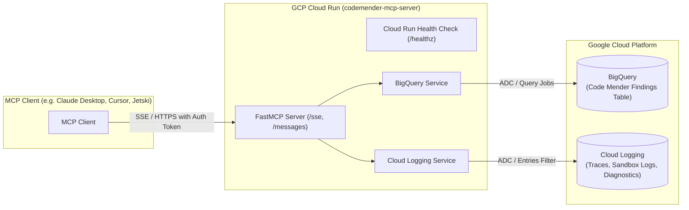

# Code Mender Triage MCP Server (GCP Cloud Run)

A Model Context Protocol (MCP) server running on **Google Cloud Run** to inspect, query, and triage security findings published by **Code Mender** to **BigQuery**, correlated with execution, sandbox, and diagnostic traces from **Cloud Logging**.

---

## Architecture Overview



---

## Features & Capabilities

### 1. BigQuery Inspection (Code Mender Findings)
- **`list_codemender_issues`**: Query and filter security issues published by Code Mender. Filter by severity (`CRITICAL`, `HIGH`, etc.), status (`DETECTED`, `PATCH_GENERATED`, `VERIFIED`, `FIXED`, `FAILED`), repository, vulnerability type / CWE, date range, or text search.
- **`get_issue_details`**: Fetch full details for a specific issue ID / finding ID, including code snippets, generated patches / diffs, verification results, and remediation status.
- **`get_issues_summary`**: High-level aggregated statistics: total findings, open vs. resolved counts, severity breakdown, and top 5 recurring vulnerabilities.
- **`get_bigquery_schema`**: Inspect BigQuery table schemas, columns, types, and descriptions to guide custom queries.
- **`query_codemender_bigquery`**: Execute safe, parameterized, read-only SQL queries (`SELECT` and `WITH` statements only).

### 2. Cloud Logging Correlation (Diagnostics & Traces)
- **`get_issue_logs`**: Automatically correlates logs with a specific finding ID or Code Mender `session_id`. Retrieves compiler output, sandbox execution traces, and error logs.
- **`search_codemender_logs`**: Search Cloud Logging across Code Mender jobs and workers for exceptions, sandbox policy violations (e.g., blocked commands), or scan failures.

### 3. MCP Resources & Prompts
- **Resource `codemender://schema`**: BigQuery schema representation of the findings table.
- **Resource `codemender://critical-issues`**: Live list of the most recent critical findings.
- **Prompt `triage_issue`**: Automated investigation prompt guiding the LLM to inspect the issue in BigQuery, fetch correlated logs, review the patch diff, and recommend next actions.
- **Prompt `diagnose_remediation_failure`**: Automated prompt guiding the LLM to diagnose why a Code Mender patch or verification run failed.

---

## File Structure

```
.
├── config.py                  # Pydantic configuration from environment variables
├── server.py                  # FastMCP server with tools, resources, and Cloud Run routes
├── services/
│   ├── __init__.py
│   ├── bigquery_service.py    # BigQuery client, parameterized queries, and serialization
│   └── logging_service.py     # Cloud Logging client, filter generation, and formatting
├── tests/
│   ├── __init__.py
│   └── test_server.py         # Unit tests with mocks for BigQuery and Logging
├── Dockerfile                 # Multi-stage, secure non-root Dockerfile for Cloud Run
├── .dockerignore              # Clean container build context
├── requirements.txt           # Python dependencies (mcp, google-cloud-*, uvicorn, etc.)
├── deploy_cloud_run.sh        # Turnkey deployment script for Cloud Run with CLI flags
├── cloudbuild.yaml            # CI/CD pipeline configuration
└── README.md                  # Project documentation
```

---

## Configuration

The server is configured via environment variables (automatically read from Cloud Run or `.env`):

| Variable | Description | Default |
| :--- | :--- | :--- |
| `GCP_PROJECT_ID` | GCP Project ID hosting BigQuery & Logging | ADC Project |
| `BQ_DATASET` | BigQuery dataset containing Code Mender findings | `codemender` |
| `BQ_TABLE` | BigQuery table containing findings | `findings` |
| `LOG_NAME_FILTER` | Substring filter for Code Mender logs | `codemender` |
| `PORT` | HTTP port to listen on (injected by Cloud Run) | `8080` |
| `HOST` | Host address to bind | `0.0.0.0` |

---

## Quick Start: Local Development

### 1. Install Dependencies
```bash
python3 -m venv venv
source venv/bin/activate
pip install -r requirements.txt
```

### 2. Authenticate with Google Cloud
Ensure Application Default Credentials (ADC) are configured:
```bash
gcloud auth application-default login
gcloud config set project YOUR_PROJECT_ID
```

### 3. Run Unit Tests
```bash
python3 -m unittest discover -s tests -p "test_*.py"
```

### 4. Run the Server Locally
```bash
python3 server.py
```
The server will start on `http://0.0.0.0:8080`:
- **Health check**: `http://localhost:8080/healthz`
- **Root info**: `http://localhost:8080/`
- **MCP SSE Endpoint**: `http://localhost:8080/sse`

---

## Deploying to Google Cloud Run

### Option 1: Automated Script (`deploy_cloud_run.sh`)

The provided [`deploy_cloud_run.sh`](file:///usr/local/google/home/abambah/l400-security-labs/deploy_cloud_run.sh) script handles the entire deployment process:
1. Enables required GCP APIs (`run`, `bigquery`, `logging`, `artifactregistry`, `cloudbuild`).
2. Provisions a dedicated runtime service account (`codemender-mcp-sa`).
3. Grants least-privilege IAM roles:
   - `roles/bigquery.dataViewer` (reads findings tables)
   - `roles/bigquery.jobUser` (runs query jobs)
   - `roles/logging.viewer` (reads Cloud Logging entries)
4. Builds the container image from the [`Dockerfile`](file:///usr/local/google/home/abambah/l400-security-labs/Dockerfile) and deploys to Cloud Run.

#### Basic Run:
```bash
./deploy_cloud_run.sh --project "YOUR_PROJECT_ID"
```

#### Run with Custom Options:
```bash
./deploy_cloud_run.sh \
  --project "my-security-project" \
  --region "us-central1" \
  --service "codemender-mcp-server" \
  --dataset "codemender" \
  --table "findings"
```

#### CLI Flags Available in `deploy_cloud_run.sh`:
- `-p, --project PROJECT_ID`: GCP Project ID.
- `-r, --region REGION`: GCP Region (default: `us-central1`).
- `-s, --service SERVICE_NAME`: Cloud Run service name (default: `codemender-mcp-server`).
- `-d, --dataset DATASET`: BigQuery dataset name (default: `codemender`).
- `-t, --table TABLE`: BigQuery table name (default: `findings`).
- `--allow-unauthenticated`: Permit unauthenticated calls (default: require IAM auth).
- `-h, --help`: Display usage guide.

---

### Option 2: Manual Step-by-Step Deployment with `gcloud`

```bash
PROJECT_ID="your-project-id"
REGION="us-central1"
SERVICE_NAME="codemender-mcp-server"
SA_NAME="codemender-mcp-sa"
SA_EMAIL="${SA_NAME}@${PROJECT_ID}.iam.gserviceaccount.com"

# 1. Enable GCP APIs
gcloud services enable run.googleapis.com bigquery.googleapis.com logging.googleapis.com cloudbuild.googleapis.com --project="${PROJECT_ID}"

# 2. Create Service Account
gcloud iam service-accounts create "${SA_NAME}" \
  --display-name="Code Mender MCP Server Runtime SA" \
  --project="${PROJECT_ID}"

# 3. Grant IAM roles
gcloud projects add-iam-policy-binding "${PROJECT_ID}" \
  --member="serviceAccount:${SA_EMAIL}" \
  --role="roles/bigquery.dataViewer"

gcloud projects add-iam-policy-binding "${PROJECT_ID}" \
  --member="serviceAccount:${SA_EMAIL}" \
  --role="roles/bigquery.jobUser"

gcloud projects add-iam-policy-binding "${PROJECT_ID}" \
  --member="serviceAccount:${SA_EMAIL}" \
  --role="roles/logging.viewer"

# 4. Deploy to Cloud Run
gcloud run deploy "${SERVICE_NAME}" \
  --source="." \
  --project="${PROJECT_ID}" \
  --region="${REGION}" \
  --service-account="${SA_EMAIL}" \
  --port=8080 \
  --cpu=1 \
  --memory=1Gi \
  --set-env-vars="GCP_PROJECT_ID=${PROJECT_ID},BQ_DATASET=codemender,BQ_TABLE=findings" \
  --no-allow-unauthenticated
```

---

## Verifying the Deployment

Get the assigned Cloud Run URL:
```bash
SERVICE_URL=$(gcloud run services describe codemender-mcp-server \
  --region=us-central1 \
  --format='value(status.url)')

echo "Service URL: ${SERVICE_URL}"
```

Test the health check endpoint:
```bash
curl -f -H "Authorization: Bearer $(gcloud auth print-identity-token)" \
  "${SERVICE_URL}/healthz"
```

Expected output:
```json
{
  "status": "healthy",
  "service": "codemender-mcp-server",
  "project": "your-project-id",
  "dataset": "codemender",
  "table": "findings"
}
```

---

## Connecting MCP Clients

Connect your MCP client to the Cloud Run SSE endpoint (`${SERVICE_URL}/sse`):

### 1. Claude Desktop
Add to your `claude_desktop_config.json`:
```json
{
  "mcpServers": {
    "codemender": {
      "url": "https://<your-service-url>.a.run.app/sse",
      "headers": {
        "Authorization": "Bearer YOUR_IDENTITY_TOKEN"
      }
    }
  }
}
```

### 2. Cursor / JetBrains / Jetski
Configure the MCP server:
- **Protocol / Transport**: `sse`
- **URL**: `https://<your-service-url>.a.run.app/sse`
- **Headers**: `Authorization: Bearer <GCP_IDENTITY_TOKEN>`

---

## Example Tool Invocations

### 1. Find Open Critical Findings in a Repository
```json
{
  "name": "list_codemender_issues",
  "arguments": {
    "repository": "frontend-service",
    "severity": "CRITICAL",
    "status": "OPEN",
    "limit": 10
  }
}
```

### 2. Inspect Patch and Remediation Details
```json
{
  "name": "get_issue_details",
  "arguments": {
    "issue_id": "FINDING-2026-9812"
  }
}
```

### 3. Retrieve Cloud Logging Traces for a Failing Fix
```json
{
  "name": "get_issue_logs",
  "arguments": {
    "issue_id": "FINDING-2026-9812",
    "min_severity": "WARNING"
  }
}
```
