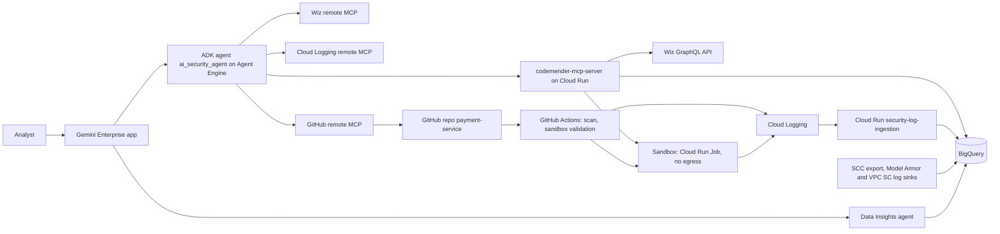

# AI Security Agent Lab (branch: `ai-security-agent-lab`)

This branch turns the Code Mender MCP server into a 4-hour hands-on lab. Participants build an AI security agent on Gemini Enterprise that pulls from Wiz, Cloud Logging, GitHub, CodeMender, and BigQuery. They use it to triage alerts, investigate cloud security questions, and fix vulnerable code with a human approving every change.

The original MCP server is still here, in `mcp-server/`, with new tools added. It is one of the four MCP servers the agent uses.

> **Status: work in progress.** This commit has most of the lab. Some pieces are still being built. See [Branch status](#branch-status) before running the lab.

## What participants build

An ADK agent (`ai_security_agent`) deployed to Vertex AI Agent Engine and registered in Gemini Enterprise. It connects to four MCP servers:

| MCP server | Used for |
|---|---|
| Wiz remote MCP (`mcp.app.wiz.io`) | Issues, vulnerabilities, cloud graph |
| Cloud Logging remote MCP (`logging.googleapis.com/mcp`) | Log entries from scans, sandbox runs, services |
| GitHub remote MCP (`api.githubcopilot.com/mcp`) | Repo code, workflow runs, pull requests |
| `codemender-mcp-server` (this repo, Cloud Run) | BigQuery findings, SCC / Model Armor / VPC SC data, code-to-cloud mapping, sandbox runs |

The agent is used for two jobs:

1. **Conversational investigation.** Questions that need several sources, such as "What are our top 5 critical internet-facing vulnerabilities in production?" or "Which service accounts in the payment service have excessive permissions?" The agent answers in plain language. It traces a runtime vulnerability back to the Git repo, base image, or Terraform file it came from.
2. **Code remediation with a human in the loop.** The agent takes a Wiz or CodeMender finding, finds the vulnerable code, and writes a small patch. It tests the patch in an isolated sandbox, then opens a pull request with a security justification. A person reviews and merges it. The agent has no merge tool.

## Architecture


```mermaid
flowchart LR
    user["Analyst"] --> ge["Gemini Enterprise app"]
    ge --> agent["ADK agent ai_security_agent on Agent Engine"]
    ge --> dia["Data Insights agent"]

    agent --> wizmcp["Wiz remote MCP"]
    agent --> logmcp["Cloud Logging remote MCP"]
    agent --> ghmcp["GitHub remote MCP"]
    agent --> cmmcp["codemender-mcp-server on Cloud Run"]

    cmmcp --> bq[("BigQuery")]
    cmmcp --> wizapi["Wiz GraphQL API"]
    cmmcp --> job["Sandbox: Cloud Run Job, no egress"]

    ghmcp --> repo["GitHub repo payment-service"]
    repo --> gha["GitHub Actions: scan, sandbox validation"]
    gha --> job
    gha --> logging["Cloud Logging"]
    job --> logging
    logging --> ingest["Cloud Run security-log-ingestion"]
    ingest --> bq

    scc["SCC export, Model Armor and VPC SC log sinks"] --> bq
    dia --> bq
```

## Repository layout

| Directory | Contents |
|---|---|
| `lab/` | Lab guide modules 00-08, troubleshooting, cleanup |
| `mcp-server/` | The custom MCP server (moved from the repo root), with new investigation, code-to-cloud, BigQuery, and sandbox tools |
| `agent/` | ADK agent package, deploy script for Agent Engine, Gemini Enterprise registration steps |
| `agent/skills/` | Seven skills: alert triage, investigation routing, code-to-cloud attribution, root cause and patch, sandbox verification, PR creation, BigQuery / Data Insights |
| `log-ingestion/` | Cloud Run service: Cloud Logging, then Pub/Sub, then BigQuery, using a prepared schema |
| `sandbox/` | Cloud Run Job that applies a patch and runs the PoC and unit tests with no internet access |
| `sample-app/` | `payment-service`, an intentionally vulnerable Flask app, with GitHub workflows, patches, and benign PoC tests |
| `infra/terraform/` | All GCP resources: BigQuery, Pub/Sub, log sinks, Cloud Run, VPC, Secret Manager, Workload Identity Federation, IAM |
| `seed-data/` | Sample findings, events, and logs, plus a loader, so every module works without live findings |
| `starter/` | Participant versions of selected files with TODOs to complete |

## Moved files

The server files that used to be at the repo root (`server.py`, `config.py`, `services/`, `tests/`, `Dockerfile`, `requirements.txt`, `deploy_cloud_run.sh`, `deploy.sh`, `cloudbuild.yaml`, `.env.example`, `.dockerignore`) now live in `mcp-server/`. Run the server's commands from that folder:

```bash
cd mcp-server
cp .env.example .env      # set GCP and Wiz values
./deploy_cloud_run.sh
```

## Prerequisites (from Days 1-3)

- A GCP project with billing, and Owner or the roles listed in [lab/00-overview.md](lab/00-overview.md).
- A Wiz tenant with a connected cloud account, and a Wiz admin who can enable the remote MCP server.
- A GitHub org where you can create the private `payment-service` repo and set branch protection.
- A Gemini Enterprise app in the same project, and a Gemini Enterprise admin.
- Local tools: `gcloud`, `terraform`, `git`, `gh`, Python 3.11 or later.

## Quick start

1. **Environment.** Create `lab.env` in the repo root using the cheat sheet in [lab/00-overview.md](lab/00-overview.md#environment-variables-cheat-sheet), then run `source lab.env`. The file is git-ignored.
2. **Infrastructure.** Apply Terraform in two phases. The steps are in [infra/terraform/README.md](infra/terraform/README.md).

   ```bash
   cd infra/terraform
   cp terraform.tfvars.example terraform.tfvars   # edit project_id, region, github_org, participant_members
   terraform init
   terraform apply -target=<phase-1 targets from infra/terraform/README.md>
   terraform apply
   cd ../..
   ```

3. **Seed data.**

   ```bash
   python3 seed-data/load_seed_data.py
   ```

4. **Services.**

   ```bash
   (cd mcp-server && ./deploy_cloud_run.sh)
   (cd log-ingestion && ./deploy.sh)
   (cd sandbox && ./deploy.sh)
   ```

5. **Agent, locally.**

   ```bash
   cd agent
   cp .env.example .env    # set GOOGLE_CLOUD_PROJECT, CODEMENDER_MCP_URL, GITHUB_ORG, and the rest
   pip install google-adk
   adk web
   ```

   Open http://localhost:8000 and select `security_agent`.

## Lab modules

The lab runs 4 hours, including setup checks and breaks. Participants spend most of the hands-on time connecting the MCP servers to Gemini Enterprise, wiring the agent, writing tools and skills, and running the exercises. The sandbox, log ingestion, and Terraform are pre-built: participants deploy and verify them.

| # | Module |
|---|---|
| 00 | [Overview, objectives, prerequisites](lab/00-overview.md) |
| 01 | [Wiz remote MCP and Gemini Enterprise auth](lab/01-wiz-remote-mcp.md) |
| 02 | [Cloud Logging remote MCP](lab/02-cloud-logging-remote-mcp.md) |
| 03 | [GitHub remote MCP and CI/CD](lab/03-github-remote-mcp.md) |
| 04 | [Validation sandbox](lab/04-validation-sandbox.md) |
| 05 | [Log ingestion](lab/05-log-ingestion.md) |
| 06 | [Data Insights agent on BigQuery](lab/06-data-insights-bigquery.md) |
| 07 | [Tools and skills](lab/07-tools-and-skills.md) |
| 08 | [Capability exercises](lab/08-capability-exercises.md) |
| | [Troubleshooting](lab/troubleshooting.md), [Cleanup](lab/cleanup.md) |

## Branch status

**In this commit**

| Part | Tests |
|---|---|
| `mcp-server/` | 68 unit tests pass |
| `log-ingestion/` | 74 unit tests pass |
| `sandbox/` | 38 unit tests pass |
| `seed-data/` | 28 unit tests pass |
| `agent/` and skills | 51 unit tests pass (offline, no model calls) |
| `infra/terraform/` | Not validated: Terraform was not installed in the build environment |
| `sample-app/` workflows | YAML parses; not run on a GitHub runner |
| `sample-app/` app, PoC tests, patches | Included; app tests not yet run |
| `lab/` modules 00-08, troubleshooting, cleanup | Draft |
| `starter/` | Partial: 3 files so far |

All Python files parse, all shell scripts pass `bash -n`, and a scan found no credentials. Every secret in the repo is a placeholder.

The unit tests used mocks and stubbed modules, because the build environment could not install all dependencies. Nothing here has run against a live Wiz tenant, GCP project, or GitHub org yet.

**Still to come**

- Remaining starter files with TODOs, and `lab/facilitator-guide.md` (timings, expected outputs, answer key). The modules table links to it, but it is not written yet.
- Re-timing the module text to the 4-hour schedule. Some module files still show the earlier 6-hour timings.
- A consistency pass so names, paths, and commands in the guide match the code. Modules 04-08 were written before the code was finished.
- The architecture diagram as an image, and PDF versions of the participant guide and facilitator guide.
- Fixing the line numbers in `sample-app/.codemender/mock-findings.json`, which were written before the app code existed.

**Needs a live environment to confirm**

- Wiz remote MCP enablement steps and the Wiz GraphQL field names used by the new tools.
- Gemini Enterprise custom MCP connector and OAuth setup.
- Cloud Logging and GitHub remote MCP authentication from Gemini Enterprise.
- Terraform apply, Cloud Run deploys, and the sandbox job on gen2 with egress blocked.
- GitHub Actions with Workload Identity Federation.

## Safety notes

- `sample-app/` is intentionally vulnerable: SQL injection (CWE-89), path traversal (CWE-22), a service account with `roles/editor`, and an end-of-life base image. Keep the `payment-service` repo private and do not deploy the app to a public endpoint. The PoC tests are local-only. The traversal target is a dummy file, `sample-app/data/not_a_secret.txt`.
- The sandbox runs as a Cloud Run Job on the second-generation execution environment, because Cloud Run Jobs do not support the first-generation gVisor environment. The VPC denies all egress except the restricted Google APIs range. The job's service account has no project roles, only read access to the sandbox inputs bucket.
- The agent opens pull requests and starts workflows only after the user confirms. It cannot merge. Branch protection and CODEOWNERS require one human approval.

## About CodeMender

CodeMender (Google DeepMind) has no public API. The scan workflow calls an HTTP endpoint you configure with `CODEMENDER_API_URL` and `CODEMENDER_API_TOKEN`. If those are not set, it runs in mock mode and emits the seed findings `CM-0001` to `CM-0004` from `sample-app/.codemender/mock-findings.json`. Everything downstream (logs, ingestion, BigQuery, agent) works the same either way.
